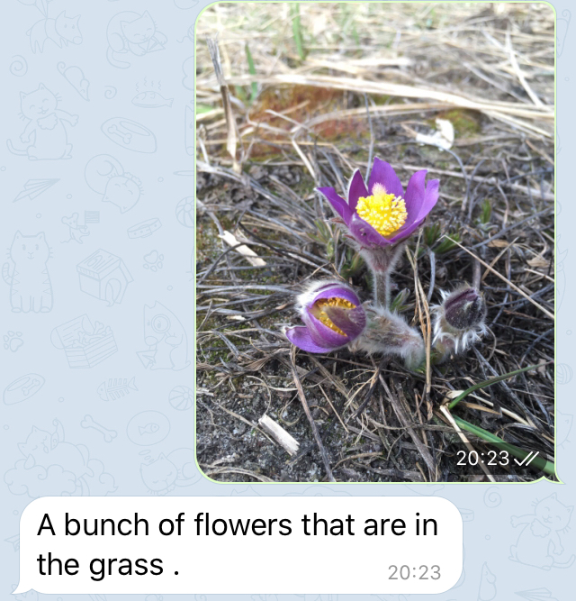
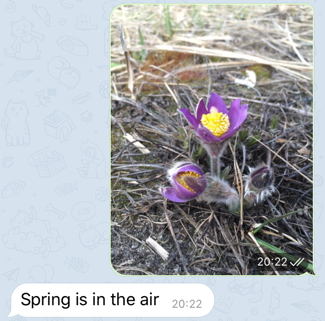
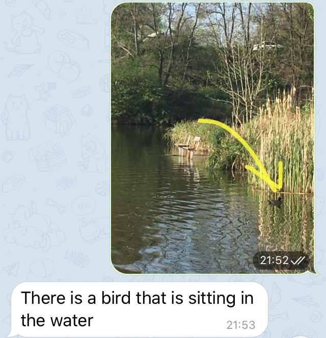
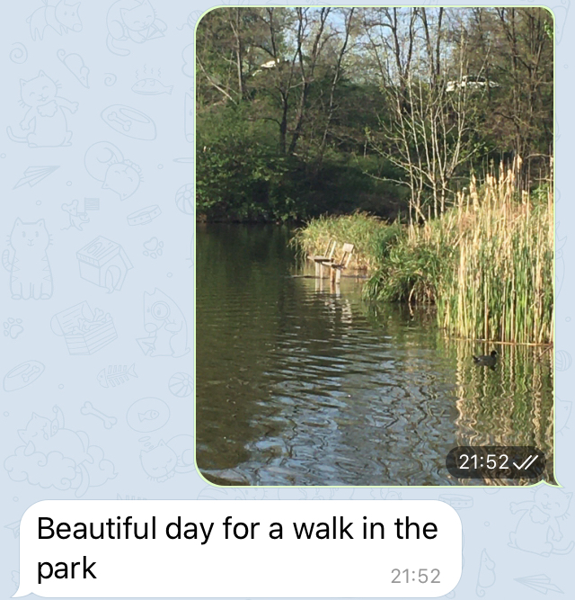
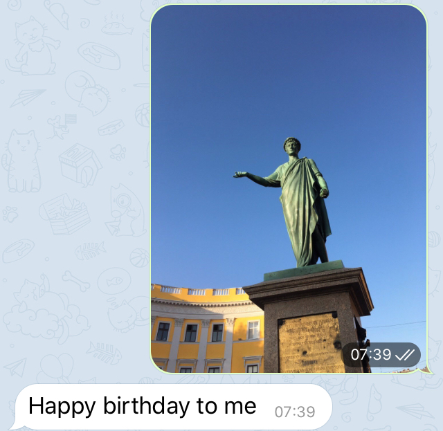
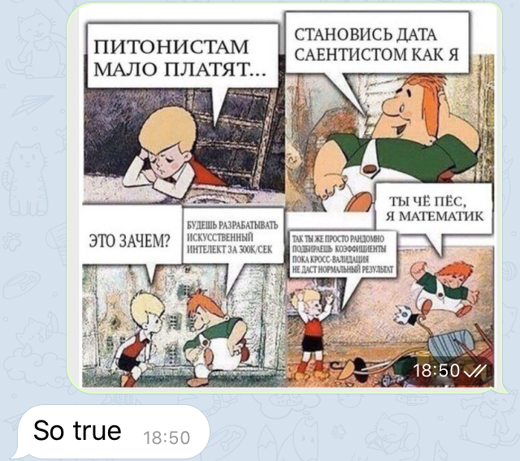

# Image-To-Text

**TL;DR:** The model was trained on [COCO2014](https://cocodataset.org/#download) and then on [IntaPIC-1.1M](https://github.com/cesc-park/attend2u/blob/master/README.md#instapic-11m-dataset). After this, following the amazing [guide](https://m.habr.com/ru/company/ods/blog/462141/) (russian) the model was deployed on GoogleCloud wrapped into Telegram bot, so you can [try it](https://web.telegram.org/#/im?p=@ImageToCaptureBot) until April 2021 (credits will run out =)).

*it seems that current weights that are used by the bot was taken from older checkpoint (when fixed hard memory error on the VM), so the captions can differ*

This repository contains implementation of simple image to text framework with pretrained encoder and LSTM as decoder. 

More specially:
* Encoder: pretrained ResNet 101 (the last classification layer was cutted off and linear layer followed by batch normalization was added) [https://arxiv.org/abs/1512.03385]
* Decoder: 3-layer unidirectional (trained using teacher forcing) LSTM [[Hochreiter & Schmidhuber. Long Short-term Memory ](https://www.researchgate.net/publication/13853244_Long_Short-term_Memory)]
* Decoder embedding matrix was initialized by the GloVe vectors (Wikipedia 2014 + Gigaword 5: 6B tokens) [https://nlp.stanford.edu/pubs/glove.pdf]

The [transformer_research](https://github.com/koren-v/Image2Text/tree/transformer_research) branch contains attemps to use Transformer Encoder-Decoder [https://arxiv.org/abs/1706.03762] architecture instead of LSTM, but the current solution is not valid.

---
Some generated captions of two models for the same pictures:

| COCO | InstaPIC
|---|---
||
||

---
Some funny captions by InstaPIC model:

